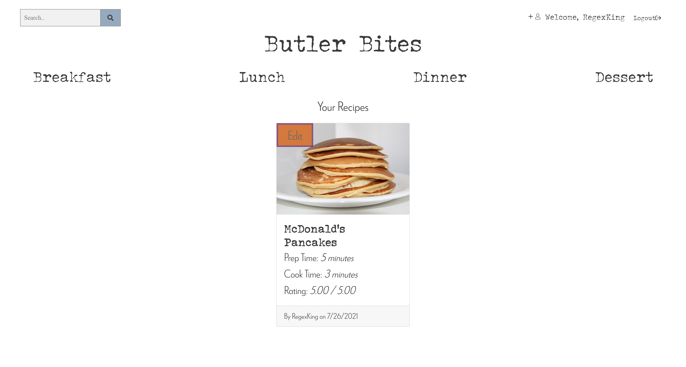

# Butler Bites

      
## Description

Butler Bites is a community website designed to allow users to post recipes and interact with other users' recipes by rating or commenting on them.

## Built With
    

### New Technologies

AWS was used to host our user-uploaded recipe photos.

Multer was used to take user files and then pass them to AWS for upload.

## Table of Contents

* [Screenshots](#screenshots)
* [Usage](#usage)
* [Known Flaws](#known-flaws)
* [Future Development](#future-development)
* [License](#license)

## Screenshots

### Homepage

### Dashboard Page

### Recipe Category Page

## Usage

To use the platform please visit [https://butler-bites.herokuapp.com/](https://butler-bites.herokuapp.com/)

## Known Flaws

* Responsiveness
* No edit / delete comment features
* No search capabilities
* When adding a new recipe:
  * Ingredients must be comma separated or the display is wrong.
  * Input boxes could allow for more customization in regard to timing mechanisms (e.g., minutes, hours, etc.) and yield adjectives (e.g., yields 2 servings or feeds 3 people)
  * No word-wrap in the directions input box
  * Error handling of incorrect image type uploads could be cleaner

* When editing a recipe:
  * Aside from the title form, a user must re-input all of the other information about the recipe.
  * Cannot update the recipe photo

* The ability to rate a recipe does not go away when a user has already rated a recipe. There is an error catch should they try to rate a previously rated recipe, but a more elegant solution is needed.

## Future Development

* Continued UI / UX refinements to improve responsiveness and overall structure
* Add ability for users to edit / delete their comments
* Implement search bar functionality
* Implement filters on respective recipe pages. Examples include by date added and by rating.
* Implement a more robust error handling mechanism. Essentially element browser alerts for a more refined notice.
* Add user profile pages so users can view each other's recipes without having to search or filter for that specific user
* Add ability for user's to save their favorite recipes
* Add integration to allow users to share recipes directly to Facebook

## License
        
### MIT
        
### Copyright 2021 Erica Babb, Jordan Turcott, & Andrew Tellitocci
        
Permission is hereby granted, free of charge, to any person obtaining a copy of this software and associated documentation files (the "Software"), to deal in the Software without restriction, including without limitation the rights to use, copy, modify, merge, publish, distribute, sublicense, and/or sell copies of the Software, and to permit persons to whom the Software is furnished to do so, subject to the following conditions:

  The above copyright notice and this permission notice shall be included in all copies or substantial portions of the Software.

  THE SOFTWARE IS PROVIDED "AS IS", WITHOUT WARRANTY OF ANY KIND, EXPRESS OR IMPLIED, INCLUDING BUT NOT LIMITED TO THE WARRANTIES OF MERCHANTABILITY, FITNESS FOR A PARTICULAR PURPOSE AND NONINFRINGEMENT. IN NO EVENT SHALL THE AUTHORS OR COPYRIGHT HOLDERS BE LIABLE FOR ANY CLAIM, DAMAGES OR OTHER LIABILITY, WHETHER IN AN ACTION OF CONTRACT, TORT OR OTHERWISE, ARISING FROM, OUT OF OR IN CONNECTION WITH THE SOFTWARE OR THE USE OR OTHER DEALINGS IN THE SOFTWARE.
      
  